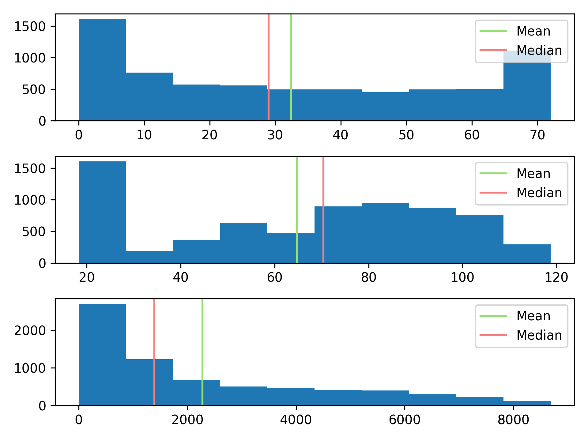
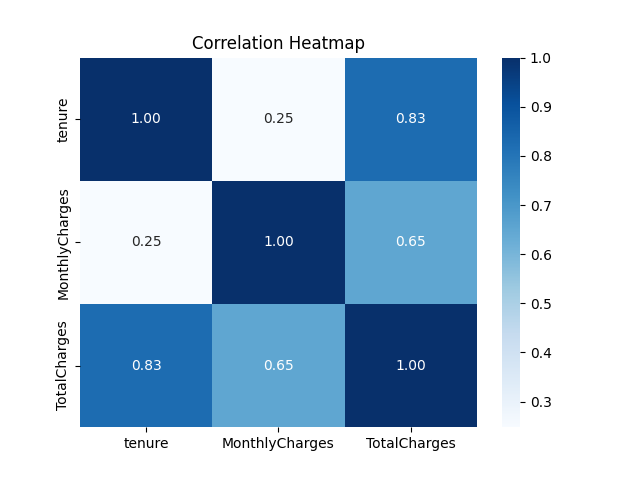
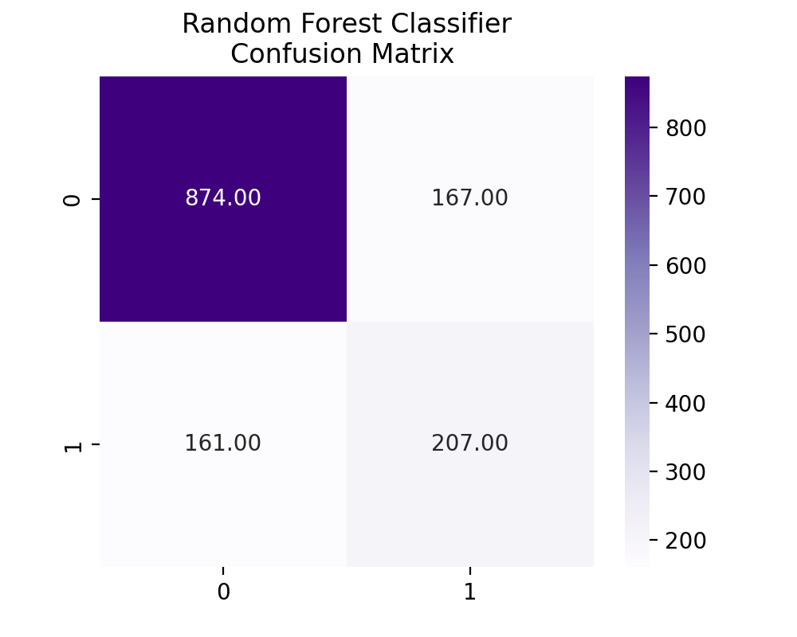

# Customer Churn Prediction

## Overview
This project is a **Customer Churn Prediction** model based on the **Telco Customer Churn** dataset from Kaggle. The model predicts whether a customer is likely to churn using machine learning techniques. The dataset contains various customer details, including demographics, account details, and usage statistics.

## Dataset
- **Source:** Kaggle - [Telco Customer Churn](https://www.kaggle.com/datasets/blastchar/telco-customer-churn)
- **Features:** Customer demographics, service subscriptions, and billing details.
- **Target Variable:** `Churn` (Binary: `Yes` → 1, `No` → 0)

## Project Structure
```
├── datasets/
│   ├── Telco-Customer-Churn.csv
│
├── visualizations/
│   ├── numeric_data_subplot.png
│   ├── numeric_data_heatmap.png
│   ├── rfc_confusion_matrix.png
│
├── src/
│   ├── main.py
│
├── LICENSE.md
├── README.md
├── .gitignore
├── requirements.txt
├── encoders.pkl (Not pushed to GitHub)
├── churn_classifier_rfc_model.pkl (Not pushed to GitHub)
```

## Installation & Setup
### **1. Clone the Repository**
```bash
git clone https://github.com/arush18/customer-churn-prediction.git
cd customer-churn-prediction
```
### **2. Install Dependencies**
Make sure you have Python installed, then install the required libraries:
```bash
pip install -r requirements.txt
```

### **3. Run the Script**
```bash
python main.py
```

## Data Preprocessing
- **Dropped Irrelevant Columns:** Removed `customerID`.
- **Handled Missing Values:** Converted empty spaces in `TotalCharges` to `0.0` and changed its datatype to float.
- **Label Encoding:** Encoded categorical features using `LabelEncoder` (saved as `encoders.pkl`).
- **Oversampling:** Used **SMOTE** to balance the dataset.

## Model Training & Evaluation
- **Algorithms Used:**
  - Decision Tree
  - Random Forest (Selected based on highest cross-validation accuracy)
  - XGBoost

- **Model Selection:**
  - Used **cross-validation** to compare models.
  - **Random Forest Classifier** was chosen as the final model.
  - The trained model was saved as `churn_classifier_rfc_model.pkl`.

- **Evaluation Metrics:**
  - Accuracy Score
  - Confusion Matrix

### **Model Performance**

```
Model: Decision Tree ——> Cross Validation Score: 0.78
Model: Random Forest ——> Cross Validation Score: 0.84
Model: XGBoost ——> Cross Validation Score: 0.83
————————————————————————————————————————————————————————————

Random Forest Classifier:
Accuracy Score: 0.77
```

## Visualizations
The project includes various visualizations stored in the `visualizations/` folder:
- **Numeric Data Distribution:**
  - The distribution of numeric data is not uniform, making it unsuitable for training without proper transformations. The distribution has higher frequencies at the beginning and end rather than being centered around the mean and median.
  

- **Feature Correlation Heatmap:**
  - The correlation between `tenure` and `TotalCharges` is **0.83**, indicating a strong positive relationship, meaning longer tenure is highly associated with higher total charges.
  - The correlation between `tenure` and `MonthlyCharges` is **0.25**, which suggests a weak relationship, indicating that monthly charges do not necessarily increase with tenure.
  - The correlation between `MonthlyCharges` and `TotalCharges` is **0.65**, meaning that while monthly charges contribute to total charges, there are other influencing factors.
  

- **Confusion Matrix (Random Forest Classifier):**
  - The confusion matrix shows that the model correctly predicted **874** non-churned customers (`0s`) but incorrectly classified **167** as churned (`1s`).
  - It also incorrectly classified **161** churned customers (`1s`) as non-churned (`0s`) but correctly predicted **207** churned customers.
  

## License
This project is open-source and available under the MIT License.

---


## Data Preprocessing

- **Dropped Irrelevant Columns:** Removed `customerID`.
- **Handled Missing Values:** Converted empty spaces in `TotalCharges` to `0.0` and changed its datatype to float.
- **Label Encoding:** Encoded categorical features using `LabelEncoder` (saved as `encoders.pkl`).
- **Oversampling:** Used **SMOTE** to balance the dataset.

## Model Training & Evaluation

- **Algorithms Used:**

  - Decision Tree
  - Random Forest (Selected based on highest cross-validation accuracy)
  - XGBoost

- **Model Selection:**

  - Used **cross-validation** to compare models.
  - **Random Forest Classifier** was chosen as the final model.
  - The trained model was saved as `churn_classifier_rfc_model.pkl`.

- **Evaluation Metrics:**

  - Accuracy Score
  - Confusion Matrix

### **Model Performance**

```
Model: Decision Tree ——> Cross Validation Score: 0.78
Model: Random Forest ——> Cross Validation Score: 0.84
Model: XGBoost ——> Cross Validation Score: 0.83
————————————————————————————————————————————————————————————

Random Forest Classifier:
Accuracy Score: 0.77
```

## Visualizations

The project includes various visualizations stored in the `visualizations/` folder:


## Future Improvements

- Implement additional feature engineering.
- Try more advanced models like Neural Networks.
- Optimize hyperparameters for better accuracy.
- Deploy the model using Flask or FastAPI.

## Contributing

Feel free to fork the repository, create a new branch, and submit a pull request.

## License

This project is open-source and available under the MIT License.

---